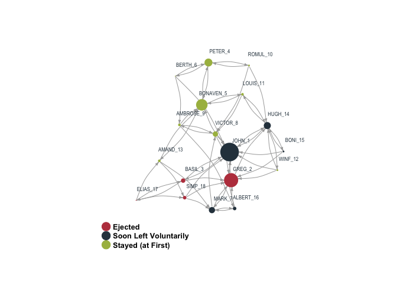
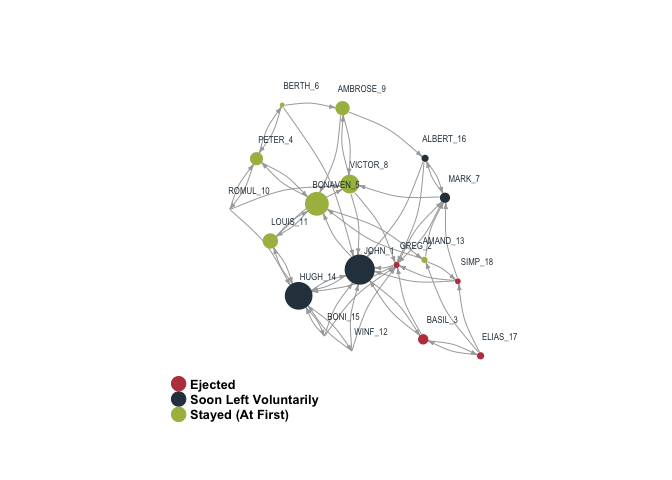
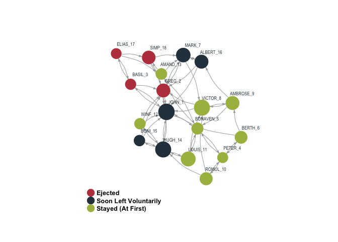
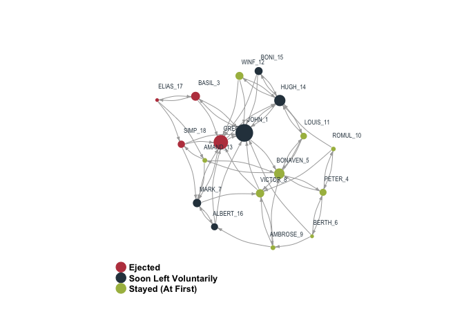
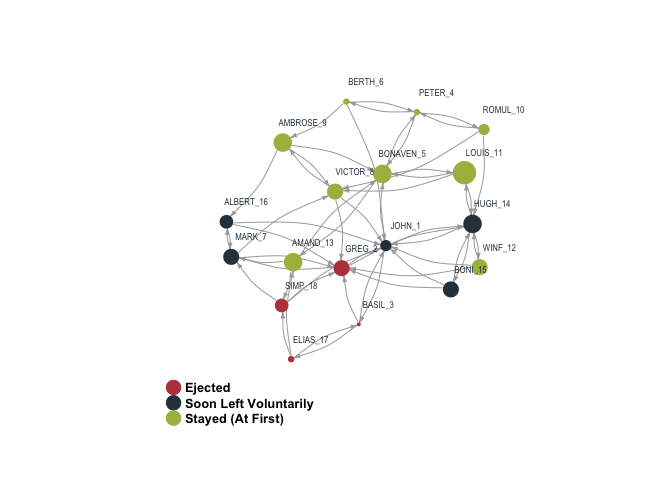
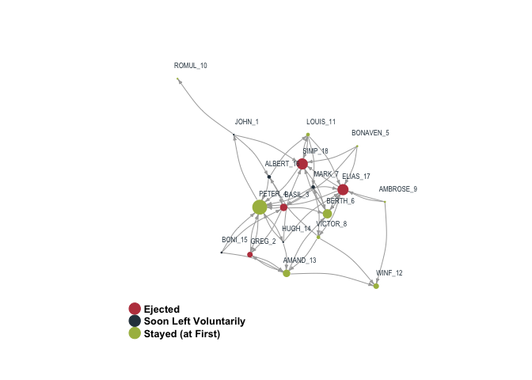
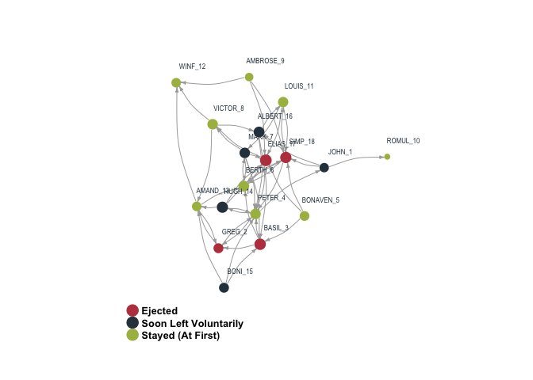
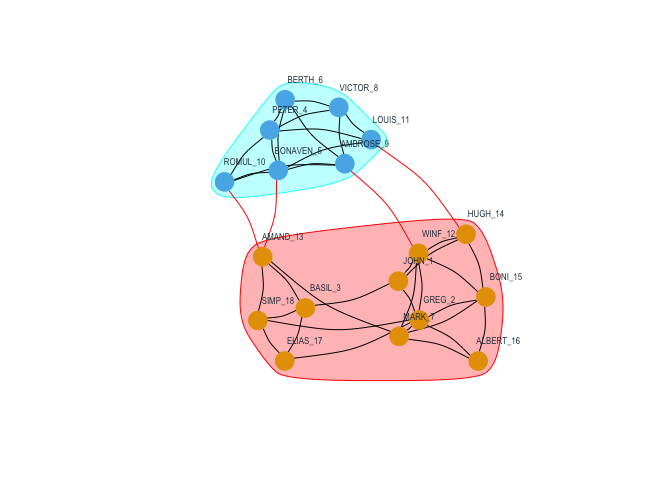

# Sampson Monk Networks
## Introduction and Background

**Characteristics of Sampson Network Dataset**  
The Sampson Monastery social network data \[1\] was collected by Vermont
sociologist Samuel F. Sampson. This data was collected when Sampson was
studying and observing the social interactions of a group of monks. He
collected a number of rankings and network data for a monastery
cloister. During his period of study, a “crisis in the cloister”
resulted in the expulsion of monk **2**, **3**, **17**, and **18**;
furthermore, monk **1**, **7**, **14**, **15** and **16** left on their
own volition early during this conflict. Afterward **5**, **6**, **9**
and **11** were the only monks remaining in the cloister (meaning that
the remaining monks left more gradually during this ‘crisis’).\[2\]

*Note: I chose to look at these outcomes of cloister
membership/ejection/leaving as node attributes (compiled into a
`cloister_outcomes` df below) as I think they will be interesting to
look at when thinking about node centrality. However, because the
network data and number of individuals in each outcome group are
relatively small (potentially impacting statistical significance), I
will be focusing primarily on differences in networks SAMPLK1 and
SAMPNIN. Simple regressions with attribute data will be
run to explore further in .*

The ties consist of how *each* of the monks rank one another -
specifically, it asks each monk to rank their esteem, liking, and
perceived influence (i.e., negative, positive) of their fellow monks.
The specific rank types (informing the networks) can be obtained below:

| Data Set                         |         |
|----------------------------------|---------|
| First Wave - ‘Liking’ (0-3)\*\*  | SAMPLK1 |
| Second Wave - ‘Liking’ (0-3)\*\* | SAMPLK2 |
| Third Wave - ‘Liking’ (0-3)      | SAMPLK3 |
| Esteem                           | SAMPES  |
| Disesteem                        | SAMPDES |
| Liking                           | SAMPLK  |
| Disliking                        | SAMPDLK |
| Positive Influence               | SAMPIN  |
| Negative Influence               | SAMPNIN |
| Praise                           | SAMPPR  |
| Blame                            | SAMPNPR |

\*\* - First and Second Wave of ‘Liking’ were compiled prior to the
‘cloister conflict’; remaining data was compiled during the conflict.

The 1-3 designation is ascending - that is, 1 refers to the monk’s third
(‘last’) choice and 3 refers to his first choice. To illustrate, this
means that a monk’s incoming 3-valued tie in the matrix **SAMPNIN**
indicates that another monk sees them as the “most negative influence;”
and a monk’s **SAMPLK1** 1-valued tie indicates that another monk likes
them the third-most in the cloister. Each monk is compelled to rank
exactly 3 monks on this designation, meaning that outgoing ties can only
be 3 (unvalued) or 6 (valued). Because the nature of these ties is
**directed**, the matrix is thus asymmetrical. It is also impossible to
have 100% density in the ties. In fact, assuming that the monks have
followed the guidelines of this study, the network density should be
somewhat consistent at 3/17 or 0.18.

*code snippets: load and set up data* 
``` r
dfmonks_SAMPLK1<-read.csv('sampson_agent_agent[SAMPLK1].csv',header = FALSE)
dfmonks_SAMPLK1<-dfmonks_SAMPLK1[1:18]
dfmonks_SAMPNIN<-read.csv('sampson_agent_agent[SAMPNIN].csv',header = FALSE)
dfmonks_SAMPNIN <-dfmonks_SAMPNIN[1:18]
dfmonks_SAMPLK3<-read.csv('sampson_agent_agent[SAMPLK3].csv',header = FALSE)
dfmonks_SAMPLK3<-dfmonks_SAMPLK3[1:18]
```

``` r
#set up column names in chunk above - I will be applying these names to matrices as needed. 
colnames = c("ROMUL_10","BONAVEN_5","AMBROSE_9","BERTH_6","PETER_4","LOUIS_11","VICTOR_8","WINF_12","JOHN_1","GREG_2","HUGH_14","BONI_15","MARK_7","ALBERT_16","AMAND_13","BASIL_3","ELIAS_17","SIMP_18")
#Note that individuals with '0' in all three columns stayed in the cloister for a while and then left. To this point, I constructed a df to reflect whether the monks stayed, left, or remained in the end. 
monks <- colnames
voluntarily.left.first <-c(0,0,0,0,0,0,0,0,1,0,1,1,1,1,0,0,0,0)
expelled <- c(0,0,0,0,0,0,0,0,0,1,0,0,0,0,0,1,1,1)
remained.end <- c(0,1,1,1,0,1,0,0,0,0,0,0,0,0,0,0,0,0)
cloister_outcomes <- data.frame(monks, voluntarily.left.first, expelled, remained.end)
```

**Characteristics of SAMPLK1 **  
As indicated in the README, SAMPLK1 consists of rankings of liking for other
monks in the cloister prior to the conflict. As shown in the network
density below, it appears that we have one more ranking than expected
(the density value is higher than expected, indicating that there may be
one more non-zero rating than expected).

``` r
#names for df rows and columns 
colnames(dfmonks_SAMPLK1) <- colnames
rownames(dfmonks_SAMPLK1) <- colnames

#set up network matrix etc. 
matrix_SAMPLK1 <- as.matrix.data.frame(dfmonks_SAMPLK1)
net = network(matrix_SAMPLK1, directed = TRUE)

#network density
print(paste('network density - SAMPLK1:', network.density(network(matrix_SAMPLK1, directed = TRUE))))
```

    ## [1] "network density - SAMPLK1: 0.179738562091503"

``` r
#set up igraph object 
graph_SAMPLK1 <- graph.adjacency(matrix_SAMPLK1, mode = "directed", weighted = TRUE)

#appended attributes 
vertex_attr(graph_SAMPLK1, index=cloister_outcomes$monks) <- cloister_outcomes
```

## Centrality

### Exploration of Centrality - SAMPLK1

Below is the cloister centrality for **SAMPLK1**. I looked at degree
centrality (in and out), closeness centrality, between-ness centrality,
bonaccich centrality, and eigenvector centrality. Note that centrality
measures are looking at my nodes as though they were unvalued, because
it’s easier to interpret in this way. I chose to initially not normalize
my networks.

``` r
#set up df for centrality 
cloister_centrality <- merge(cloister_outcomes, 
                           data.frame( 
                             ID= V(graph_SAMPLK1)$monks,  
                             in.deg= igraph::degree(graph_SAMPLK1, mode = c("in"), loops = TRUE, normalized = FALSE),
                             out.deg= igraph::degree(graph_SAMPLK1, mode = c("out"), loops = TRUE, normalized = FALSE),
                             btwn= igraph::betweenness(graph_SAMPLK1, directed = T),
                             close = igraph::closeness(graph_SAMPLK1, mode = c("all")),
                             eigen = igraph::evcent(graph_SAMPLK1),
                             bon  = igraph::bonpow(graph_SAMPLK1)
                           )
                           ) %>%
  dplyr::group_by(ID, in.deg,out.deg,btwn,close,eigen.vector,bon) %>%
  dplyr::summarize() %>% dplyr::rename(monks=ID)
cloister_centrality
```

    ## # A tibble: 18 × 7
    ## # Groups:   monks, in.deg, out.deg, btwn, close, eigen.vector [18]
    ##    monks     in.deg out.deg   btwn  close eigen.vector    bon
    ##    <chr>      <dbl>   <dbl>  <dbl>  <dbl>        <dbl>  <dbl>
    ##  1 ALBERT_16      2       3 18.9   0.0222        0.400 -0.938
    ##  2 AMAND_13       2       3 16.3   0.0185        0.272 -0.563
    ##  3 AMBROSE_9      2       3 37.9   0.0222        0.272 -0.563
    ##  4 BASIL_3        2       3 27.6   0.0179        0.506 -1.69 
    ##  5 BERTH_6        1       3 13     0.0204        0.218 -1.50 
    ##  6 BONAVEN_5      5       3 63.2   0.0192        0.597 -0.563
    ##  7 BONI_15        1       3  0.833 0.0182        0.454 -0.750
    ##  8 ELIAS_17       1       3 19.3   0.0172        0.207 -1.5  
    ##  9 GREG_2         7       3 16.2   0.0222        0.822 -0.750
    ## 10 HUGH_14        6       4 73.6   0.0256        0.637 -0.563
    ## 11 JOHN_1         9       3 80.1   0.0263        1     -1.13 
    ## 12 LOUIS_11       2       3 40.8   0.0238        0.372 -0.188
    ## 13 MARK_7         4       3 27.1   0.0233        0.475 -0.750
    ## 14 PETER_4        3       3 35     0.0175        0.399 -1.50 
    ## 15 ROMUL_10       1       3  2     0.0208        0.259 -1.12 
    ## 16 SIMP_18        2       3 15.5   0.0217        0.413 -0.938
    ## 17 VICTOR_8       4       3 49.9   0.0256        0.474 -0.750
    ## 18 WINF_12        1       3  0.833 0.0182        0.454 -0.750

``` r
cloister_outcomes_1 <- merge(cloister_centrality,cloister_outcomes, on='monks')
graph_SAMPLK1 <- graph.adjacency(matrix_SAMPLK1, mode = "directed", weighted = TRUE)
vertex_attr(graph_SAMPLK1, index=cloister_outcomes_1$monks) <- cloister_outcomes_1
```

I also looked at the correlation matrix between measures of centrality.

``` r
cor(cloister_centrality[2:7])
```

    ##                 in.deg   out.deg      btwn     close eigen.vector       bon
    ## in.deg       1.0000000 0.3142704 0.7477510 0.6246333    0.9085019 0.1822486
    ## out.deg      0.3142704 1.0000000 0.4560166 0.3752099    0.2167296 0.2149317
    ## btwn         0.7477510 0.4560166 1.0000000 0.6107762    0.5759273 0.2083115
    ## close        0.6246333 0.3752099 0.6107762 1.0000000    0.4890422 0.4279377
    ## eigen.vector 0.9085019 0.2167296 0.5759273 0.4890422    1.0000000 0.1375661
    ## bon          0.1822486 0.2149317 0.2083115 0.4279377    0.1375661 1.0000000

The following are some of my findings around the degree, between,
closeness, eigenvalue centrality, and bonacich centrality for
**SAMPLK1**:

*degree centrality:*

``` r
colrs <- c("#BC424C","#2D3F4C","#A9BA4F")
V(graph_SAMPLK1)$color <- ifelse(V(graph_SAMPLK1)$expelled == 1, "#BC424C", 
                                 ifelse(V(graph_SAMPLK1)$voluntarily.left.first==1,  "#2D3F4C","#A9BA4F"))
                             
V(graph_SAMPLK1)$size <- ifelse(degree(matrix_SAMPLK1,cmode="indegree") != 0, degree(matrix_SAMPLK1*1.2,cmode="indegree"), 5)

plot (graph_SAMPLK1, vertex.frame.color = NA, vertex.label.cex = 0.6, vertex.label = V(graph_SAMPLK1)$monks, vertex.label.color='#2D3F4C', edge.curved = .2,vertex.label.alpha=0.6, edge.arrow.size =.3, vertex.label.family="Arial Narrow",vertex.label.dist=3)
legend(x=-1.5, y=-1.1, c("Ejected","Soon Left Voluntarily","Stayed (at First)"), pch=21,
       col=colrs, pt.bg=colrs, pt.cex=2, cex=.8, bty="n", ncol=1,text.font = 2)
```



-   Because of the nature of the data collected (i.e., each monk asked
    to rank their top 3 monks in the cloister for each dimension listed
    above), **out.deg** or the degree of outward ties made by the ego
    (in this case, of ‘liking’) is not very interesting; all ties are
    at 3. This being said, I also did not include the general two-way
    degree centrality because I felt that **out.degree** is not very
    meaningful.  
-   The individuals with the highest levels of **in.deg** were JOHN_1 (9
    ties directed toward him from his fellow monks), GREG_2 (7 ties
    total directed toward him from his fellow monks), and HUGH_14 (6
    ties ibid). Meanwhile, even though no monks were not nominated at
    all, it must be noted that some such as BERTH_6 and ELIAS_17
    experienced very low levels of in-degree centrality.  
-   Due to the constant level of **out.deg**, the highest **in.deg**
    nodes were also the highest prestige.  
-   Correlations of degree and other centrality measures are described
    in following subsections.

*between centrality:*

``` r
colrs <- c("#BC424C","#2D3F4C","#A9BA4F")
V(graph_SAMPLK1)$color <- ifelse(V(graph_SAMPLK1)$expelled == 1, "#BC424C", 
                                 ifelse(V(graph_SAMPLK1)$voluntarily.left.first==1,  "#2D3F4C","#A9BA4F"))
                                 
V(graph_SAMPLK1)$size <- igraph::betweenness(graph_SAMPLK1, directed = T)*0.3

plot (graph_SAMPLK1, vertex.frame.color = NA, vertex.label.cex = 0.6, vertex.label = V(graph_SAMPLK1)$monks, vertex.label.color='#2D3F4C', edge.curved = .2,vertex.label.alpha=0.6, edge.arrow.size =.3, vertex.label.family="Arial Narrow",vertex.label.dist=3)
legend(x=-1.5, y=-1.1, c("Ejected","Soon Left Voluntarily","Stayed (At First)"), pch=21,
       col=colrs, pt.bg=colrs, pt.cex=2, cex=.8, bty="n", ncol=1,text.font = 2)
```



-   **between** measures were also noted to be somewhat related to the
    individuals’ overall degree centrality (of being liked) but also
    speaks to their capacity as a *broker* of sorts in the network (in
    this case, the concept is a bit abstract because we are now talking
    about the amount of time the liked individual likes someone who
    likes more wide array of monks in the network). In this case, many
    individuals with high levels of degree centrality also exhibited
    high levels of between centrality, including JOHN_1 (approx. 80
    ‘shortest paths’ between nodes liking one another that pass through
    John).  
-   This being said some (e.g., GREG_10) exhibited lower levels of
    between centrality (16.25 ‘shortest paths’ between nodes that pass
    through Greg - much lower than John’s ) than they did with degree
    centrality. This may be because the people Greg likes are either
    monks who also like him or popular monks like JOHN_1. In the former
    case, you are ‘back where you started’ (i.e., you are connected by
    ‘liking’ back to yourself and don’t get faster in connecting with
    other nodes that are liked throughout the network). In the latter
    case, individuals who like both Greg and John and would not be
    connected to as many new monks who like ‘new’ people and are just
    instead directed to individuals that John likes once more (i.e., the
    path of nodes who like Greg to other nodes in ‘disparate parts of
    the network’ are not shortened through liking Greg).  
-   Per this logic, individuals such as BONHAVEN_5, who seem to connect
    the ejected/leaving group with the not ejected group by being liked
    by individuals in that group (such as JOHN_1), exhibited higher
    levels of between centrality than they did with degree centrality
    (approx. 63 ‘shortest paths’ between nodes liking one another that
    pass through Bonhaven).  
-   Once again though individuals like WINF with the fewest individuals
    liking them exhibited the lowest between centrality scores (\<1
    shortest path between nodes).  
-   between centrality was strongest correlated with the in-degree
    centrality (0.74 correlation) and fairly strongly correlated with
    closeness and eigenvector (0.54 correlation).

*closeness centrality:*

``` r
colrs <- c("#BC424C","#2D3F4C","#A9BA4F")
V(graph_SAMPLK1)$color <- ifelse(V(graph_SAMPLK1)$expelled == 1, "#BC424C", 
                                 ifelse(V(graph_SAMPLK1)$voluntarily.left.first==1,  "#2D3F4C","#A9BA4F"))

#needed to blow it up for this visual because I could not see anything                                  
V(graph_SAMPLK1)$size <- igraph::closeness(graph_SAMPLK1, mode = c("all"))*1000


plot (graph_SAMPLK1, vertex.frame.color = NA, vertex.label.cex = 0.6, vertex.label = V(graph_SAMPLK1)$monks, vertex.label.color='#2D3F4C', edge.curved = .2,vertex.label.alpha=0.6, edge.arrow.size =.3, vertex.label.family="Arial Narrow",vertex.label.dist=3)
legend(x=-1.5, y=-1.1, c("Ejected","Soon Left Voluntarily","Stayed (At First)"), pch=21,
       col=colrs, pt.bg=colrs, pt.cex=2, cex=.8, bty="n", ncol=1,text.font = 2)
```



-   These measures were relatively low because closeness looks at ‘how
    fast the person can reach everyone in the network’ and looks at
    ‘liking’ the most other monks with the fewest number of indirect
    ties (i.e., liking someone who likes someone who likes someone).
    Because one can only like 3 individuals, I thought that this would
    limit the magnitude and variance in closeness centrality.  
-   This being said, the number of individuals who like the ego still
    appears to make a difference somewhat as JOHN, GREG, and HUGH all
    exhibited closeness centrality above 0.02. This is related to the
    idea that individuals closer to ‘the center’ of the network of how
    much individuals like one another would have slightly higher
    scores.  
-   This measure was somewhat highly related to the measures of degree
    and betweenness centrality (0.54 and 0.63 correlation respectively)
    which makes sense based on the nodes that are scoring high and low
    in closeness centrality. There was also a moderate correlation with
    an eigenvector.

*eigenvector:*

``` r
colrs <- c("#BC424C","#2D3F4C","#A9BA4F")

V(graph_SAMPLK1)$color <- ifelse(V(graph_SAMPLK1)$expelled == 1, "#BC424C", 
                                 ifelse(V(graph_SAMPLK1)$voluntarily.left.first==1,  "#2D3F4C","#A9BA4F"))

#needed to blow it up for this visual because I could not see anything                                  
V(graph_SAMPLK1)$size <- V(graph_SAMPLK1)$eigen.vector *20

plot (graph_SAMPLK1, vertex.frame.color = NA, vertex.label.cex = 0.6, vertex.label = V(graph_SAMPLK1)$monks, vertex.label.color='#2D3F4C', edge.curved = .2,vertex.label.alpha=0.6, edge.arrow.size =.3, vertex.label.family="Arial Narrow",vertex.label.dist=3)
legend(x=-1.5, y=-1.1, c("Ejected","Soon Left Voluntarily","Stayed (At First)"), pch=21,
       col=colrs, pt.bg=colrs, pt.cex=2, cex=.8, bty="n", ncol=1,text.font = 2)
```



-   Eigenvector once more resembles (somewhat) the values for in-degree
    centrality (these two seem also to be 90% correlated). This being
    said it looks like a number of the highest (Greg, John, etc.) and
    lowest (Winf, Elias) eigenvector centrality nodes are the same. This
    measure isn’t the best because the data isn’t symmetric; I will not
    be using this in the future.

*bonaccich:*

``` r
colrs <- c("#BC424C","#2D3F4C","#A9BA4F")

V(graph_SAMPLK1)$color <- ifelse(V(graph_SAMPLK1)$expelled == 1, "#BC424C", 
                                 ifelse(V(graph_SAMPLK1)$voluntarily.left.first==1,  "#2D3F4C","#A9BA4F"))

#needed to blow it up for this visual because I could not see anything                                  
V(graph_SAMPLK1)$size <- (2+V(graph_SAMPLK1)$bon)*10

plot (graph_SAMPLK1, vertex.frame.color = NA, vertex.label.cex = 0.6, vertex.label = V(graph_SAMPLK1)$monks, vertex.label.color='#2D3F4C', edge.curved = .2,vertex.label.alpha=0.6, edge.arrow.size =.3, vertex.label.family="Arial Narrow",vertex.label.dist=3)
legend(x=-1.5, y=-1.1, c("Ejected","Soon Left Voluntarily","Stayed (At First)"), pch=21,
       col=colrs, pt.bg=colrs, pt.cex=2, cex=.8, bty="n", ncol=1,text.font = 2)
```



-   Per the literature, bonaccich works best with valued ties, and
    correlates the least with our measures (\~20-25% correlation). This
    is on purpose, as individuals who are more ‘centrally located’ on a
    network would naturally be the least ‘powerful’ under Bonaccich’s
    theorem.  
-   Under this assumption, people such as Louis (who we haven’t really
    seen as much) have the most ‘power’ with bonaccich values of
    -0.18.  
-   This value however once more doesn’t make a ton of meaning because
    this matrix was not symmetric.

*conclusions:*  
I think that in the context of this network and the nature of these
ties, the idea of in-network degree centrality is one of the more
meaningful (followed potentially by between-ness centrality) because the
‘first wave liking’ in the context of Sampson’s study is a good measure
of ‘popularity’ of sorts, which does tell us something about the group
dynamics. It was interesting that overall, individuals who ended up
being expelled and individuals who left seemed to have more central
nodes of degree centrality (specifically, Greg and John) within the
cloister.

### Exploration of Centrality - SAMPNIN

I wanted to look primarily now at SAMPNIN, which consists of rankings
monks in the cloister in the midst of the conflict by the amount that
they see other monks in the cloister as a negative influence. Once more
this is a weighted and asymmetric matrix, so I am removing a number of
centrality measures when I am looking at this measure; I am furthermore
only looking at this once more as though it were unvalued.

As this is a similar procedure and same data set, I will be keeping a
number of parameters the same and maintaining similar visualizations. I
think that as we are looking for a somewhat opposite measure (negative
sentiment) at a very different point in time, we should expect to see
very different nodes with high levels of network centrality. I do not
think it will be the total opposite, however (i.e., I don’t think the
lowest individuals with the ‘liked’ network centrality would be the
absolute highest individuals for ‘negative influence’ network
centrality) because I think notoriety still plays a part in the
cloisters. I hypothesize that some individuals with the lowest in-degree
centrality will thus not necessarily have the highest in-degree
centrality in this network data, because other monks in the cloister may
not think about them as often.

``` r
#names for df rows and columns 
colnames(dfmonks_SAMPNIN) <- colnames
rownames(dfmonks_SAMPNIN) <- colnames

#set up network matrix etc. 
matrix_SAMPNIN <- as.matrix.data.frame(dfmonks_SAMPNIN)
net = network(matrix_SAMPNIN, directed = TRUE)

#network density
print(paste('network density - SAMPNIN:', network.density(network(matrix_SAMPNIN, directed = TRUE))))
```

    ## [1] "network density - SAMPNIN: 0.163398692810458"

``` r
#set up igraph object 
graph_SAMPNIN <- graph.adjacency(matrix_SAMPNIN, mode = "directed", weighted = TRUE)

#appended attributes 
vertex_attr(graph_SAMPNIN, index=cloister_outcomes$monks) <- cloister_outcomes
```

Note that the network density is under 0.176 which indicates that not
everyone ranked all 3 monks considered to be a bad influence.

Below is the cloister centrality for **SAMPNIN**. I looked at incoming
degree centrality, closeness centrality, and betweenness centrality. I
chose not to normalize my measures because the network should not be
substantially different given that the dataset and nomination
constraints are comparable to the previous findings of **SAMPLK1**. 

*Note: For this section, I will not have as much discussion about the
general principles underlying the centrality measures - I will assume
that they hold true with this data set unless I see otherwise, and
observations will focus instead on differences in node centrality from
SAMPLK1*

``` r
#set up df for centrality measures
#removed the least relevant centrality measures as the nature of this matrix is similar. 
#removed other centrality measures that I didn't think were super relevant 
cloister_centrality <- merge(cloister_outcomes, 
                           data.frame( 
                             ID= V(graph_SAMPNIN)$monks,  
                             in.deg= igraph::degree(graph_SAMPNIN, mode = c("in"), loops = TRUE, normalized = FALSE),
                             btwn= igraph::betweenness(graph_SAMPNIN, directed = T),
                             close = igraph::closeness(graph_SAMPNIN, mode = c("all"))
                           )
                           ) %>%
  dplyr::group_by(ID, in.deg,,btwn,close) %>%
  dplyr::summarize() %>% dplyr::rename(monks=ID)
cloister_centrality
```

    ## # A tibble: 18 × 4
    ## # Groups:   monks, in.deg, btwn [18]
    ##    monks     in.deg  btwn  close
    ##    <chr>      <dbl> <dbl>  <dbl>
    ##  1 ALBERT_16      2 22.3  0.0204
    ##  2 AMAND_13       4 11.5  0.0182
    ##  3 AMBROSE_9      0  0    0.0161
    ##  4 BASIL_3        4 24    0.0217
    ##  5 BERTH_6        5 35    0.0204
    ##  6 BONAVEN_5      0  0    0.0185
    ##  7 BONI_15        0  0    0.0189
    ##  8 ELIAS_17       6 41.7  0.0222
    ##  9 GREG_2         3  7.83 0.0189
    ## 10 HUGH_14        1 13.8  0.0213
    ## 11 JOHN_1         1 23.8  0.0179
    ## 12 LOUIS_11       2 10    0.0196
    ## 13 MARK_7         2  6    0.02  
    ## 14 PETER_4        8 59.2  0.02  
    ## 15 ROMUL_10       1  0    0.0114
    ## 16 SIMP_18        6 25.5  0.0213
    ## 17 VICTOR_8       2 23.5  0.02  
    ## 18 WINF_12        3  0    0.0182

``` r
#cloisteroutcomes 2 merges cloister centrality attributes with monk outcomes. 
cloister_outcomes_2 <- merge(cloister_centrality,cloister_outcomes, on='monks')
graph_SAMPNIN <- graph.adjacency(matrix_SAMPNIN, mode = "directed", weighted = TRUE)
vertex_attr(graph_SAMPNIN, index=cloister_outcomes_2$monks) <- cloister_outcomes_2
```

I also looked at the correlation matrix between measures of centrality.

``` r
cor(cloister_centrality[2:4])
```

    ##           in.deg      btwn     close
    ## in.deg 1.0000000 0.8159213 0.4745369
    ## btwn   0.8159213 1.0000000 0.5401482
    ## close  0.4745369 0.5401482 1.0000000

The following are some of my findings around centrality for **SAMPNIN**:

*degree centrality:*

``` r
colrs <- c("#BC424C","#2D3F4C","#A9BA4F")
V(graph_SAMPNIN)$color <- ifelse(V(graph_SAMPNIN)$expelled == 1, "#BC424C", 
                                 ifelse(V(graph_SAMPNIN)$voluntarily.left.first==1,  "#2D3F4C","#A9BA4F"))
                             
V(graph_SAMPNIN)$size <- V(graph_SAMPNIN)$in.deg*1.8

plot (graph_SAMPNIN, vertex.frame.color = NA, vertex.label.cex = 0.6, vertex.label = V(graph_SAMPNIN)$monks, vertex.label.color='#2D3F4C', edge.curved = .2,vertex.label.alpha=0.6, edge.arrow.size =.3, vertex.label.family="Arial Narrow",vertex.label.dist=2.5)
legend(x=-1.5, y=-1.1, c("Ejected","Soon Left Voluntarily","Stayed (at First)"), pch=21,
       col=colrs, pt.bg=colrs, pt.cex=2, cex=.8, bty="n", ncol=1,text.font = 2)
```



-   It appears that individuals who were popular before (in particular,
    JOHN_1) seem to have remained un-bothered. No one really nominated
    John as a negative influence and he seems to be well liked by the
    entire cloister (corresponding with his very high degree centrality
    of being liked in the SAMPLK1 network).  
-   Others such as PETER_4 emerge with high level of in-network
    centrality of being nominated as being a bad influence (8
    nominations from other monks). I noted that several of those who
    nominated Peter as a bad influence were ejected or left.  
-   Some, such as WINF, ROMUL, and BONI did in fact emerge with very low
    centrality in both datasets, others (Elias for example) became more
    substantial in degree centrality when others were asked to nominate
    negative influences.

*between centrality:*

``` r
colrs <- c("#BC424C","#2D3F4C","#A9BA4F")
V(graph_SAMPNIN)$color <- ifelse(V(graph_SAMPNIN)$expelled == 1, "#BC424C", 
                                 ifelse(V(graph_SAMPNIN)$voluntarily.left.first==1, "#2D3F4C","#A9BA4F"))
                                 
V(graph_SAMPNIN)$size <- igraph::betweenness(graph_SAMPNIN, directed = T)*0.3

plot (graph_SAMPNIN, vertex.frame.color = NA, vertex.label.cex = 0.6, vertex.label = V(graph_SAMPNIN)$monks, vertex.label.color='#2D3F4C', edge.curved = .2,vertex.label.alpha=0.6, edge.arrow.size =.3, vertex.label.family="Arial Narrow",vertex.label.dist=3)
legend(x=-1.5, y=-1.1, c("Ejected","Soon Left Voluntarily","Stayed (At First)"), pch=21,
       col=colrs, pt.bg=colrs, pt.cex=2, cex=.8, bty="n", ncol=1,text.font = 2)
```


-   Once more, findings are fairly consistent with the in-degree in that
    PETER_4 (in this case) is even more central when looking at
    between-ness - he also nominated individuals who did not nominate
    him (in this case, JOHN_1), decreasing the ‘steps’ for others ‘to’
    JOHN and ROMUL based on a path of nominating those who were
    ‘untrustworthy.’

*closeness centrality:*

``` r
colrs <- c("#BC424C","#2D3F4C","#A9BA4F")
V(graph_SAMPNIN)$color <- ifelse(V(graph_SAMPNIN)$expelled == 1, "#BC424C", 
                                 ifelse(V(graph_SAMPNIN)$voluntarily.left.first==1,  "#2D3F4C","#A9BA4F"))

V(graph_SAMPNIN)$size <- igraph::closeness(graph_SAMPNIN, mode = c("all"))*500


plot (graph_SAMPNIN, vertex.frame.color = NA, vertex.label.cex = 0.6, vertex.label = V(graph_SAMPNIN)$monks, vertex.label.color='#2D3F4C', edge.curved = .2,vertex.label.alpha=0.6, edge.arrow.size =.3, vertex.label.family="Arial Narrow",vertex.label.dist=3)
legend(x=-1.5, y=-1.1, c("Ejected","Soon Left Voluntarily","Stayed (At First)"), pch=21,
       col=colrs, pt.bg=colrs, pt.cex=2, cex=.8, bty="n", ncol=1,text.font = 2)
```

 - I
am having more issues seeing a differentiation between these nodes;
however, ROMUL_10 stands out as an individual with low closeness
centrality. This makes sense because this individual is really far from
the center as only one person far from the center, JOHN_1, nominated
him. His centrality degree was 0.011 vs 0.015-0.02+ for other monks in
this network.

I found it interesting overall that individuals in this community still
had a decently high level of density, meaning that while there appeared
to be some monks with high in-degree and between-ness centrality as
perceived negative influences (PETER in particular), this network was
more connected than I expected (i.e., there were more people nominated
as one of the ‘most untrustworthy’ by other monks). I did note that some
of the more ‘popular’ monks identified in the previous exercise (JOHN
and GREG) continued to enjoy relatively low centrality in being viewed
as negative influences, even though the ‘cloister’ issues had begun.
This indicates to me that these individuals potentially were well-liked
enough to insulate them from being viewed as ‘negative influences’ by
the individuals who liked them, even though they eventually were
expelled.

I want to explore more deeply the relationship between the in-degree
centrality of the individuals’ wave I popularity (SAMPLK1), the
in-degree centrality of the during-schism individual’s being perceived
as negative influences, and whether they were ultimately expelled. I
would hypothesize that individuals with low popularity and low
viewership as a negative influence would not be expelled, whilst
individuals with high popularity and high negative influence degree
would be more likely asked to leave (this is not really in alignment
with Bonaccich’s theory of centrality and power - I theorize that
individuals with higher centrality of being liked could influence other
peoples’ decisions, and thus would be more of a threat to the cloister
if they were more ‘negative influences’).

### Centrality and Conflict

Finally, I would hypothesize that individuals who were lower popularity
and lower negative influence would be most likely to be the ‘last ones
standing’ because they may have been out of the way of loyalties and
drama that cause the split (i.e., perhaps no one ranked these monks as
‘liked’ because these monks were more isolated and did not bother others
in the cloister at all).

I wanted to test this hypothesis by making two linear regressions. For
my first, I want to look at in-degree centrality in pre-conflict
popularity and in-degree centrality in cloister perceived level of
monk’s negative influence vs. whether the monk was expelled from the
cloister.

``` r
cloister_outcomes_1 <- cloister_outcomes_1 %>% dplyr::rename(in.deg_liked = in.deg) %>% dplyr::rename(btwn.liked = btwn) %>% dplyr::rename (close.liked = close) 
cloister_outcomes_1 <- cloister_outcomes_1 %>% group_by(monks, in.deg_liked,btwn.liked, close.liked) %>% summarize()
cloister_outcomes_2 <- cloister_outcomes_2 %>% dplyr::rename(in.deg_nin = in.deg) %>% dplyr::rename(btwn.nin = btwn) %>% dplyr::rename (close.nin = close) 
cloister_outcomes_3 <- merge(cloister_outcomes_1,cloister_outcomes_2, on='monks')
```

Because the result variables are binomial I am using log odds.

``` r
summary(glm(expelled ~ in.deg_liked + in.deg_nin, cloister_outcomes_3,family = "binomial"))
```

    ## 
    ## Call:
    ## glm(formula = expelled ~ in.deg_liked + in.deg_nin, family = "binomial", 
    ##     data = cloister_outcomes_3)
    ## 
    ## Deviance Residuals: 
    ##     Min       1Q   Median       3Q      Max  
    ## -1.9012  -0.5205  -0.4214  -0.2101   1.6730  
    ## 
    ## Coefficients:
    ##              Estimate Std. Error z value Pr(>|z|)  
    ## (Intercept)   -4.0836     2.1943  -1.861   0.0627 .
    ## in.deg_liked   0.2231     0.3171   0.704   0.4817  
    ## in.deg_nin     0.6303     0.3685   1.710   0.0872 .
    ## ---
    ## Signif. codes:  0 '***' 0.001 '**' 0.01 '*' 0.05 '.' 0.1 ' ' 1
    ## 
    ## (Dispersion parameter for binomial family taken to be 1)
    ## 
    ##     Null deviance: 19.069  on 17  degrees of freedom
    ## Residual deviance: 14.690  on 15  degrees of freedom
    ## AIC: 20.69
    ## 
    ## Number of Fisher Scoring iterations: 5

As I hypothesized at first, I think that the small size
of the cloisters has led to really low p-values for most coefficients in
my two models - all but the coefficient for **in-deg nin** vs expulsion
were not even statistically significant at the 90% level.

For model 1 (expulsion vs in-degree centrality for being liked and being
viewed as negative influence), the coefficients were in the direction I
expected (more well-liked and more negative influences were more likely
to be expelled); however, only the in-degree centrality as negative
influence could be interpreted as statistically significant, and can be
summarized as follows:

-   Assuming keeping in-degree of being liked constant , each additional
    unweighted vote from the cloister as being a bad influence increases
    the monk’s likelihood of being expelled by 63% on average
    (statistically significant at the 90% level).  
-   Keeping in-degree of being a bad influence constant , each
    additional unweighted vote from the cloister as being a liked
    increases the monk’s likelihood of being expelled by 22% on average
    (not statistically significant).

``` r
summary(glm(remained.end ~ in.deg_liked + in.deg_nin, cloister_outcomes_3, family = "binomial"))
```

    ## 
    ## Call:
    ## glm(formula = remained.end ~ in.deg_liked + in.deg_nin, family = "binomial", 
    ##     data = cloister_outcomes_3)
    ## 
    ## Deviance Residuals: 
    ##     Min       1Q   Median       3Q      Max  
    ## -1.2330  -0.6665  -0.5252  -0.2848   1.9765  
    ## 
    ## Coefficients:
    ##              Estimate Std. Error z value Pr(>|z|)
    ## (Intercept)    0.3795     1.3250   0.286    0.775
    ## in.deg_liked  -0.2498     0.3081  -0.811    0.418
    ## in.deg_nin    -0.3860     0.3333  -1.158    0.247
    ## 
    ## (Dispersion parameter for binomial family taken to be 1)
    ## 
    ##     Null deviance: 19.069  on 17  degrees of freedom
    ## Residual deviance: 17.070  on 15  degrees of freedom
    ## AIC: 23.07
    ## 
    ## Number of Fisher Scoring iterations: 5

For Model 2 (staying in the end vs the degree centrality of being liked
/ being a bad influence), each additional nomination for being liked
corresponds with an average of -0.24 likelihood of staying (ceteris
paribus); each nomination for being a bad influence corresponded with a
-0.38 likelihood for staying to the end on average (ceteris paribus).
However, these coefficients were not statistically significant.

Overall, my hypotheses from the end of Model 3 were supported in terms
of direction of coefficient but not in terms of statistical significance
(except for the negative influence in-degree centrality and expulsion
hypothesis); thus I cannot reject the null hypothesis using these
models. I would however note the following general observations (based
on looking at centrality measures for SAMPLK1 and SAMPNIN) that the
following were general trends emerging from my analysis):

-   There were a number of individuals who were not nominated much for
    either Liking (Wave I) or Negative Influence; these individuals
    tended to exhibit low level of centrality and generally did not
    leave (initially) or be expelled. They appear a bit isolated from
    the cloister chaos.  
-   Some individuals (based on in-degree and between centrality) were
    not Liked but percieved as a Negative Influence (in particular,
    PETER). I wonder if this individual exhibits a great deal of formal
    power or was the individual leading to the expulsion and leaving of
    the other monks in the cloister (interestingly, and perhaps
    explaining this individual was disliked, PETER viewed the very
    well-liked JOHN as a negative influence).  
-   Similar to other networks, the outcomes visualized throughout the
    networks above have seemed to indicate the existence of subgroups
    (or perhaps ‘cliques’) because the ‘liking’ networks seems to have
    division in terms of network ‘location’ of individuals expelled /
    left vs individuals who stayed; this ‘division’ is not visually
    apparent when looking at the network of perceived negative influence
    because nodes in the expelled/left group tended to point fingers at
    individuals in the initially stayed group. This dataset could be
    further explored in future work.

## Community Detection

### Girvan-Newman and Random Walk

this network undirected for the purpose of looking at groups; will not
be using min for reason stated above. I also appended the attributes for
this outcome

``` r
colnames(dfmonks_SAMPLK3) <- colnames
rownames(dfmonks_SAMPLK3) <- colnames
matrix_SAMPLK3 <- as.matrix.data.frame(dfmonks_SAMPLK3)

graph_SAMPLK3 <- graph.adjacency(matrix_SAMPLK3, mode = "undirected", weighted = TRUE)

vertex_attr(graph_SAMPLK3, index=cloister_outcomes$monks) <- cloister_outcomes
```

#### Girvan-Newman

``` r
monks_gn <- edge.betweenness.community (graph_SAMPLK3, directed = TRUE, edge.betweenness = TRUE, merges = TRUE,
                                  bridges = TRUE, modularity = TRUE, membership = TRUE)

plot(monks_gn, graph_SAMPLK3,vertex.frame.color = NA, vertex.label.cex = 0.6, vertex.label = V(graph_SAMPLK3)$monks, vertex.label.color='#2D3F4C', edge.curved = .2,vertex.label.alpha=0.6, edge.arrow.size =.3, vertex.label.family="Arial Narrow",vertex.label.dist=3)
```


One of the things that I wanted to look at and note was how these groups
relate to the outcomes of these monks (i.e., whether they were expelled,
left immediately, or stayed). I thought that perhaps there would be
shared community membership between those who were expelled and those
who then left voluntarily - based on the previous lab, it seemed that
many of those who left liked some of those expelled in Wave 1 (thus
potentially left in protest of the other individuals’ expulsion) - thus,
I thought that community membership may reflect this pattern.  
Based on the groups formed using the Girvan-Newman community detection
algorithm, I noted that monks in **group 1** seemed to include all of
the monks remaining at the end.
(**BONAVEN_5**,**AMBROSE_9**,**BERTH_6**,**LOUIS_11**), as well as a few
additional monks.  
Also, I noted that the individuals who were expelled were all in **group
3**, other than **GREG_2**; furthermore, all of those who left
voluntarily were in **group 2**.

#### Random Walk Community Algorithm

I chose 50 steps because of the relatively small size of this data set.

``` r
monks_wt <- walktrap.community(graph_SAMPLK3, steps=50, modularity=TRUE)
monks_wt
```

    ## IGRAPH clustering walktrap, groups: 2, mod: 0.4
    ## + groups:
    ##   $`1`
    ##    [1]  8  9 10 11 12 13 14 15 16 17 18
    ##   
    ##   $`2`
    ##   [1] 1 2 3 4 5 6 7
    ## 

``` r
plot(monks_wt, graph_SAMPLK3,vertex.frame.color = NA, vertex.label.cex = 0.6, vertex.label = V(graph_SAMPLK3)$monks, vertex.label.color='#2D3F4C', edge.curved = .2,vertex.label.alpha=0.6, edge.arrow.size =.3, vertex.label.family="Arial Narrow",vertex.label.dist=3)
```



I noted here that Group 2 included the same individuals in Group 1 of
the Girvan Newman algorithm.  
The Girvan-Newman algorithm found three groups; the Random Walk
algorithm found two. As discussed above, it appears that there are some
similarities in the groupings (I believe that the exact match between
Group 1 for the Girvan and the Group 2 in the random walk algorithm
could be due in part to the relative simplicity and smaller size of this
particular dataset).

Methodologically, the differences that exist are generally because the
random walk is focused on cluster similarity (with diffusion distance)
rather than on edge betweenness (the focus of Girvan Newman).

I then compared the algorithms statistically:

``` r
options(digits=2)

metric <- c("Variation of Information","Split Join","Normalized Mutual Info","Rand Index", "Adjusted Rand")
value <- c(compare(monks_gn, monks_wt, method= c("vi")),
           compare(monks_gn, monks_wt, method= c("split.join")),
           compare(monks_gn, monks_wt, method= c("nmi")),
           compare(monks_gn, monks_wt, method= c("rand")),
           compare(monks_gn, monks_wt, method= c("adjusted.rand")))
                   
compared_algorithms <- data.frame(metric, value)
compared_algorithms
```

    ##                     metric value
    ## 1 Variation of Information  0.40
    ## 2               Split Join  4.00
    ## 3   Normalized Mutual Info  0.77
    ## 4               Rand Index  0.82
    ## 5            Adjusted Rand  0.63

-   The variation of information is 0.4, meaning that 40% of info will
    be lost and gained by using the walktrap (random walk) partition vs
    the Girvan-Newman partition.  
-   The split-join is 4, meaning 4 nodes would need to change groupings
    to make a perfect match (this makes sense as group 3 - the
    additional grouping within the G-N partition - had 3 monks that were
    all clustered in group 1 for the random walk)  
-   The Normalized Mutual Information Measure is +0.77, which is
    somewhat close to a perfect match (+1.0)  
-   The rand index is even higher, at +0.82; however the Adjusted Rand
    is a bit lower at +0.63. The adjusted rand accounts for the expected
    similarity of all pair-wise comparisons between clusters, specified
    by a random model (i.e., accounting for a baseline) - thus this
    makes some sense.

### Conclusions: Groups and Clustering

As shown above, I was correct in thinking that there were certain groups
of individuals who stayed / left; the outcomes network looks very
similar to the Girvan in particular - notably, most of the monks who
left appear in a different ‘liking’ group than the monks who were
expelled (e.g., 1 vs 2) in the Girvan partitioned groups, but they
appear in the same ‘liking’ group with the monks who were expelled in
the random walk clusters (and of course both groups are seperate from
the monks who stayed for the most part).  
Overall, this confirmed my thought that the group one was in would
correspond with what they did in response to the ‘crisis’ and what would
happen to them during the ‘crisis’. It appeared that as a result of
monks expelled (seemingly Greg in particular who is in the same girvan
group as those ‘leaving’), a number of monks seemed to leave in protest.

------------------------------------------------------------------------

\[1\] - Sampson’s Monastary Data (YEAR)
<http://www.networkdata.ics.uci.edu>

\[2\] - Sampson, S. (1969). Crisis in a cloister. Unpublished doctoral
dissertation, Cornell University.
